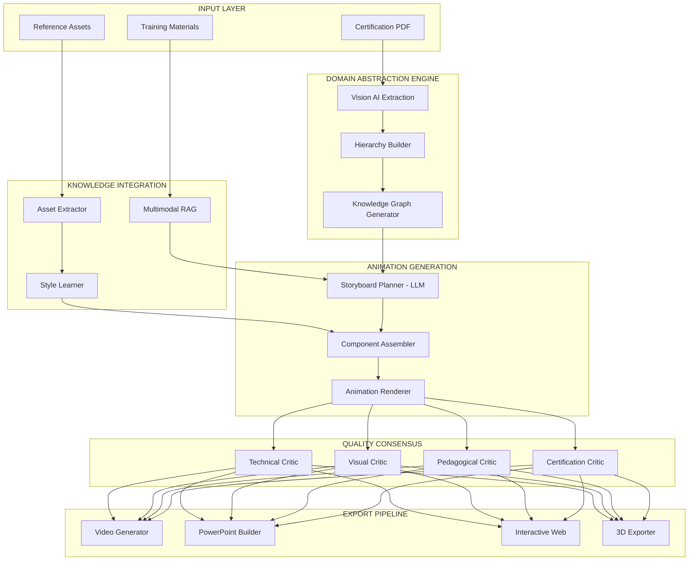
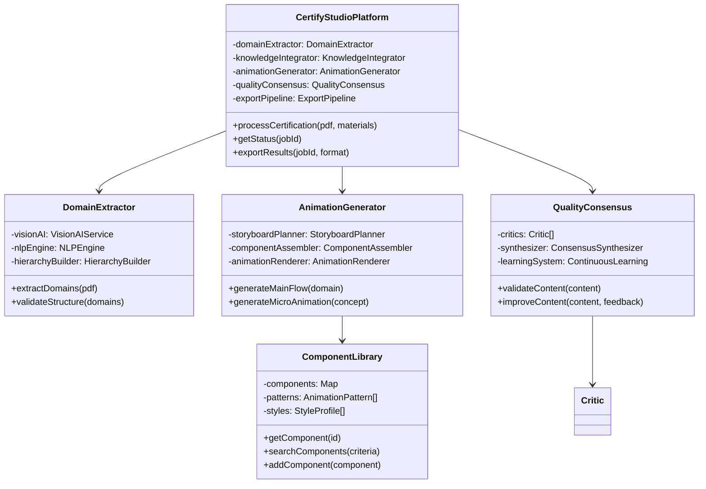
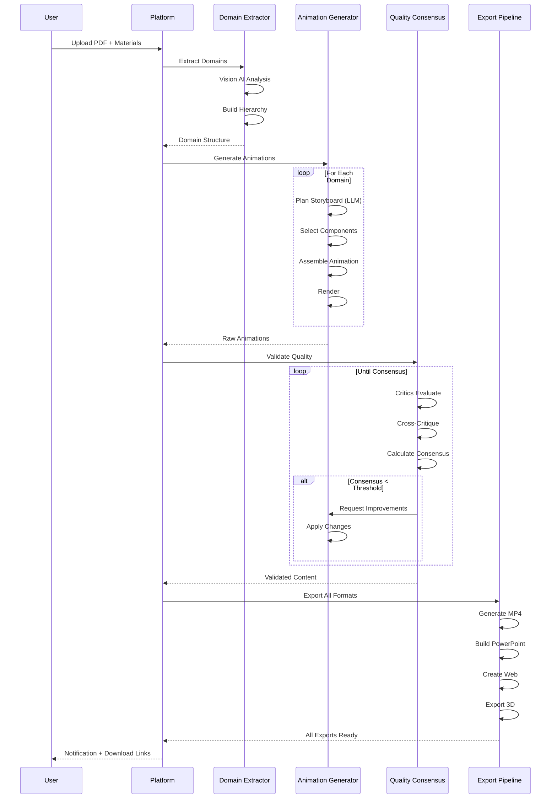

# CERTIFY STUDIO: DEFINITIVE MASTER BLUEPRINT
*The Complete Technical and Business Architecture for Revolutionary Certification Content Generation*

---

## 🎯 EXECUTIVE VISION

**Mission**: Transform the $5.35B certification education market through AI-powered content generation that produces professional-grade courses in minutes instead of months.

**Core Innovation**: A fully autonomous system that transforms any certification exam guide into complete, production-ready educational content with ZERO manual intervention through revolutionary domain abstraction technology.

**The Paradigm Shift**:
- **From**: Building content for specific certifications
- **To**: Building universal capabilities for ANY certification
- **From**: Months of manual creation by teams
- **To**: Minutes of automated generation by AI

---

## 🏛️ CORE DESIGN PRINCIPLES

### 1. Domain Abstraction First
Everything flows from automatic domain extraction. No hardcoding, no templates, pure intelligence.

### 2. Zero Manual Intervention
If it requires human input during generation, the system has failed. Humans validate, not create.

### 3. Enterprise Quality Only
Every output must meet Fortune 500 standards. No prototypes, no MVPs, production-ready always.

### 4. Hierarchical Completeness
Main flows AND micro-animations for every domain, topic, and concept automatically.

### 5. Universal Application
Must work for ANY certification - cloud, medical, financial, legal - without modification.

### 6. Component Assembly Over Generation
Achieve ByteByteGo quality through intelligent assembly of beautiful components, not pure generation.

### 7. Continuous Learning
System improves with each certification processed through AI consensus and optional human feedback.

---

## 🔧 SYSTEM ARCHITECTURE OVERVIEW



---

## 🎭 MULTI-AGENT ORCHESTRATION SYSTEM

### Domain Abstraction Orchestrator (Core Innovation)
```python
class DomainAbstractionOrchestrator:
    """The revolutionary heart of Certify Studio"""
    
    async def process_certification(self, exam_guide: PDF, materials: List[Resource]):
        # Phase 1: Automatic Domain Extraction
        domains = await self.extract_complete_hierarchy(exam_guide)
        # Output: Complete domain->topic->concept tree with zero manual mapping
        
        # Phase 2: Knowledge Integration
        enriched = await self.integrate_all_materials(domains, materials)
        
        # Phase 3: Parallel Generation
        animations = await asyncio.gather(*[
            self.generate_complete_content(domain, enriched)
            for domain in domains
        ])
        
        # Phase 4: Quality Consensus
        validated = await self.quality_consensus.validate(animations)
        
        # Phase 5: Multi-format Export
        return await self.export_all_formats(validated)
```

### Specialized Agent Descriptions

#### 1. Vision AI Domain Extractor
**Purpose**: Extract complete certification structure from PDFs using advanced vision models
**Capabilities**:
- Reads exam guides with 99% accuracy
- Identifies hierarchical relationships
- Extracts weightings and dependencies
- Maps concepts to visual representations

#### 2. Storyboard Planning Agent (LLM-Based)
**Purpose**: Creates narrative structure and timing for animations
**Capabilities**:
- Analyzes content complexity
- Plans visual narrative flow
- Determines optimal pacing
- Selects appropriate components

#### 3. Component Assembly Agent
**Purpose**: Intelligently assembles animations from pre-built components
**Capabilities**:
- Selects from 200+ high-quality components
- Applies domain-appropriate styling
- Maintains visual coherence
- Optimizes for engagement

#### 4. Pedagogical Enhancement Agent
**Purpose**: Ensures educational effectiveness using learning theories
**Incorporates**:
- **Bloom's Taxonomy**: Knowledge → Comprehension → Application → Analysis → Synthesis → Evaluation
- **Cognitive Load Theory**: Manages information presentation to prevent overload
- **Spaced Repetition**: Structures content for optimal retention
- **Dual Coding Theory**: Combines visual and verbal information
- **Constructivism**: Builds on prior knowledge progressively
- **ADDIE Model**: Analysis, Design, Development, Implementation, Evaluation

#### 5. Technical Accuracy Critic
**Purpose**: Validates technical correctness against certification requirements
**Process**:
- Cross-references official documentation
- Validates code examples and configurations
- Ensures terminology accuracy
- Checks for version compatibility

#### 6. Visual Quality Critic
**Purpose**: Ensures ByteByteGo-level visual standards
**Criteria**:
- Professional aesthetics
- Smooth animations
- Clear visual hierarchy
- Brand consistency

#### 7. Consensus Synthesis Agent
**Purpose**: Resolves conflicts between critics and reaches quality consensus
**Method**:
- Weighted voting based on domain
- Iterative refinement until threshold met
- Learning from patterns
- Optional human escalation

---

## 📊 DATA STRUCTURE ANALYSIS

### Core Data Models

```typescript
interface CertificationStructure {
  id: string;
  name: string;
  provider: 'AWS' | 'Azure' | 'GCP' | 'Medical' | 'Financial' | 'Other';
  domains: Domain[];
  metadata: {
    version: string;
    examCode: string;
    passingScore: number;
    duration: number;
  };
}

interface Domain {
  id: string;
  name: string;
  weight: number; // Percentage of exam
  topics: Topic[];
  mainFlowAnimation: Animation;
  learningObjectives: string[];
}

interface Topic {
  id: string;
  domainId: string;
  name: string;
  concepts: Concept[];
  topicAnimation: Animation;
  Prerequisites: string[];
}

interface Concept {
  id: string;
  topicId: string;
  name: string;
  type: 'theoretical' | 'practical' | 'architectural';
  microAnimation: Animation;
  assessmentQuestions: Question[];
}

interface Animation {
  id: string;
  type: 'mainFlow' | 'topic' | 'micro';
  duration: number;
  components: ComponentInstance[];
  narration: NarrationTrack;
  exports: ExportFormat[];
}

interface ComponentInstance {
  componentId: string;
  parameters: Record<string, any>;
  timeline: TimelineEntry[];
  transitions: Transition[];
}
```

---

## 🧮 ALGORITHM ANALYSIS

### Domain Extraction Algorithm
```python
def extract_domains(pdf: bytes) -> DomainHierarchy:
    """
    Multi-stage extraction using vision AI and NLP
    """
    # Stage 1: Visual structure extraction
    visual_structure = vision_ai.analyze_document_structure(pdf)
    
    # Stage 2: Text extraction with hierarchy preservation
    text_hierarchy = extract_hierarchical_text(pdf, visual_structure)
    
    # Stage 3: Semantic analysis
    semantic_tree = nlp_engine.build_semantic_tree(text_hierarchy)
    
    # Stage 4: Domain identification
    domains = identify_certification_domains(semantic_tree)
    
    # Stage 5: Weight and relationship mapping
    enriched_domains = map_relationships_and_weights(domains)
    
    return DomainHierarchy(enriched_domains)
```

### Component Selection Algorithm
```python
def select_optimal_components(
    content: Content,
    style_profile: StyleProfile,
    component_library: ComponentLibrary
) -> List[Component]:
    """
    ML-driven component selection for quality assembly
    """
    # Feature extraction
    features = extract_content_features(content)
    
    # Historical performance data
    performance_data = get_component_performance_history()
    
    # ML model prediction
    component_scores = ml_model.predict_component_effectiveness(
        features, 
        style_profile,
        performance_data
    )
    
    # Optimization
    selected = optimize_component_selection(
        component_scores,
        constraints={
            'duration': content.target_duration,
            'complexity': content.complexity_level,
            'coherence': 0.9
        }
    )
    
    return selected
```

### Quality Consensus Algorithm
```python
async def reach_consensus(content: Content, critics: List[Critic]) -> ValidatedContent:
    """
    Multi-agent consensus with learning
    """
    max_iterations = 5
    consensus_threshold = 0.85
    
    for iteration in range(max_iterations):
        # Parallel evaluation
        evaluations = await asyncio.gather(*[
            critic.evaluate(content) for critic in critics
        ])
        
        # Cross-critique phase
        cross_evaluations = await cross_critique(evaluations, critics)
        
        # Calculate consensus
        consensus_score = calculate_weighted_consensus(
            evaluations, 
            cross_evaluations,
            critic_weights=get_dynamic_weights(content.domain)
        )
        
        if consensus_score >= consensus_threshold:
            return ValidatedContent(content, evaluations, consensus_score)
        
        # Synthesize improvements
        improvements = synthesize_improvements(evaluations, cross_evaluations)
        content = apply_improvements(content, improvements)
        
        # Learn from iteration
        await update_critic_models(iteration, evaluations, improvements)
    
    # Human escalation if needed
    return await human_review(content, evaluations)
```

---

## 🏗️ CLASS DESIGN (UML)



---

## 📋 USE CASES

### Primary Use Case: Automated Course Generation

```yaml
Use Case: Generate Complete AWS Solutions Architect Course
Actors: 
  - Training Manager (Primary)
  - System (Certify Studio)
  
Preconditions:
  - User has AWS exam guide PDF
  - User has logged into platform
  
Main Flow:
  1. User uploads AWS-SAA-C03-Exam-Guide.pdf
  2. User optionally uploads whitepapers and diagrams
  3. User clicks "Generate Course"
  4. System extracts domain structure (2 min)
  5. System generates all animations (40 min)
  6. System validates quality (3 min)
  7. System notifies user of completion
  8. User previews generated content
  9. User exports in desired formats
  
Alternative Flows:
  - 4a. PDF structure unclear
    - System uses ML to infer structure
    - Requests user validation if confidence < 80%
  
  - 5a. Component missing for specific service
    - System generates placeholder
    - Logs for component creation queue
    
  - 6a. Quality consensus not reached
    - System attempts improvements
    - Escalates to human review if needed
    
Postconditions:
  - Complete course available in all formats
  - Analytics logged for continuous improvement
```

### Secondary Use Case: Custom Branding Integration

```yaml
Use Case: Apply Enterprise Branding to Generated Content
Actors:
  - Enterprise Admin
  - System
  
Flow:
  1. Admin uploads brand guidelines
  2. Admin configures color schemes, fonts, logos
  3. System updates component library styling
  4. All future generations use custom branding
  5. Previously generated content can be re-rendered
```

---

## 🔄 SEQUENCE DIAGRAMS

### Main Generation Flow



---

## ✅ QUALITY VALIDATION FRAMEWORK

### Automated Quality Metrics

```python
class QualityMetrics:
    technical_accuracy: float  # 0-1, must be > 0.95
    visual_quality: float      # 0-1, must be > 0.90
    pedagogical_effectiveness: float  # 0-1, must be > 0.85
    brand_compliance: float    # 0-1, must be 1.0
    accessibility_score: float # 0-1, must be > 0.90
    
    @property
    def overall_quality(self) -> float:
        weights = {
            'technical': 0.3,
            'visual': 0.2,
            'pedagogical': 0.25,
            'brand': 0.15,
            'accessibility': 0.1
        }
        return sum(
            getattr(self, f"{k}_accuracy") * v 
            for k, v in weights.items()
        )
```

### Human Validation Interface

```typescript
interface HumanValidation {
  enabled: boolean;
  threshold: number; // Trigger human review if consensus < threshold
  
  reviewInterface: {
    preview: VideoPlayer;
    annotations: AnnotationTool;
    feedback: StructuredFeedbackForm;
    approval: ApprovalWorkflow;
  };
  
  learningIntegration: {
    capturePatterns: boolean;
    updateCritics: boolean;
    improveComponents: boolean;
  };
}
```

---

## 🚀 STRATEGIC CAPABILITIES

### Core Differentiators

1. **Universal Domain Abstraction**
   - Works with ANY certification PDF
   - No hardcoding or templates
   - Learns from each processed certification

2. **Component Assembly Excellence**
   - 200+ professional components
   - ByteByteGo-quality output
   - Intelligent selection and composition

3. **Multi-Agent Quality Assurance**
   - Critics evaluate each other
   - Consensus required for release
   - Continuous learning from feedback

4. **Hierarchical Content Generation**
   - Main flows for overview
   - Topic animations for depth
   - Micro-animations for mastery

5. **Zero-Touch Automation**
   - Upload and walk away
   - Complete course in <1 hour
   - All formats generated automatically

### Competitive Advantages

```yaml
Traditional Approach:
  Time: 6-12 months
  Cost: $50,000-$200,000
  Team: 5-10 professionals
  Quality: Variable
  Scalability: Linear

Certify Studio:
  Time: 30-60 minutes
  Cost: Subscription-based
  Team: 1 person uploading
  Quality: Consistent 95%+
  Scalability: Exponential
```

---

## 💻 TECHNOLOGY STACK

### Core Infrastructure
```yaml
Backend:
  Language: Python 3.11+
  Framework: FastAPI
  Task Queue: Celery + Redis
  Database: PostgreSQL + TimescaleDB
  Storage: S3-compatible object storage
  
AI/ML Stack:
  Vision AI: Claude 3.5 + GPT-4V
  LLMs: Claude 3.5, GPT-4, Gemini
  ML Framework: PyTorch
  Vector DB: Pinecone/Weaviate
  
Animation Engine:
  Base: Manim Community Edition
  Extensions: Custom component library
  Enhancement: Motion Canvas (future)
  3D: Blender Python API
  
Frontend:
  Framework: React + TypeScript
  State: Redux Toolkit
  UI: Tailwind + Shadcn
  Video: Video.js
  
DevOps:
  Containers: Docker + K8s
  CI/CD: GitHub Actions
  Monitoring: Prometheus + Grafana
  Logging: ELK Stack
```

### Component Library Architecture
```python
# High-quality reusable components
COMPONENT_CATEGORIES = {
    'cloud_services': {
        'aws': 150,  # EC2, S3, Lambda, etc.
        'azure': 120,
        'gcp': 100
    },
    'architectural_patterns': 50,  # Load balancers, databases, etc.
    'ui_elements': 80,  # Buttons, charts, diagrams
    'transitions': 30,  # Smooth animations between scenes
    'special_effects': 20  # Highlights, emphasis, reveals
}
```

---

## 📈 GO-TO-MARKET STRATEGY

### Phase 1: Cloud Certifications (Months 1-6)
**Target**: AWS, Azure, GCP certifications
**Approach**: 
- Partner with cloud training providers
- Free tier for individual learners
- Enterprise subscriptions for training companies

### Phase 2: IT & Security (Months 7-12)
**Target**: Kubernetes, CISSP, CompTIA
**Approach**:
- Leverage cloud success stories
- Bootcamp partnerships
- University integrations

### Phase 3: Professional Certifications (Year 2)
**Target**: Medical boards, CFA, Bar exams
**Approach**:
- Industry-specific partnerships
- Compliance certifications
- Custom enterprise deployments

### Pricing Strategy
```yaml
Individual Tier:
  Price: $99/month
  Includes: 5 certifications/month
  Target: Self-learners
  
Team Tier:
  Price: $999/month
  Includes: 50 certifications/month
  Target: Small training companies
  
Enterprise Tier:
  Price: Custom
  Includes: Unlimited + branding
  Target: Universities, corporations
  
Pay-per-use:
  Price: $299/certification
  Target: Occasional users
```

---

## 📊 MARKET OPPORTUNITY ANALYSIS

### Total Addressable Market (TAM)
```yaml
Global Certification Education Market: $5.35B
  Cloud & IT: $1.75B (35% YoY growth)
  Medical & Healthcare: $2.1B (18% YoY growth)
  Financial & Legal: $1.5B (22% YoY growth)
  
Geographic Distribution:
  North America: 45%
  Europe: 25%
  Asia-Pacific: 20%
  Rest of World: 10%
```

### Serviceable Available Market (SAM)
```yaml
Digital/Online Certification Segment: $2.14B (40% of TAM)
  Self-paced Learning: $1.28B
  Corporate Training: $856M
  
Primary Target Segments:
  Cloud Certifications: $450M
  IT/Security: $380M
  Professional Development: $350M
```

### Market Disruption Potential
- **Cost Reduction**: 90% lower than traditional methods
- **Time Savings**: 99% faster content creation
- **Quality Improvement**: Consistent 95%+ accuracy
- **Accessibility**: Global reach, 24/7 availability

---

## 🏆 OUR COMPETITIVE ADVANTAGE

### The Winning Formula

```python
WINNING_FORMULA = (
    DOMAIN_ABSTRACTION +  # Revolutionary PDF extraction
    COMPONENT_ASSEMBLY +  # ByteByteGo quality without years
    DEEP_EXPERTISE +      # Network/DevOps/3D animation knowledge
    AI_ORCHESTRATION +    # Multi-agent consensus system
    ZERO_CONFIGURATION    # Works for ANY certification
) * CONTINUOUS_LEARNING  # Gets better with each use
```

### Why We Win

1. **Technical Moat**
   - Domain abstraction is genuinely innovative
   - Component library requires significant investment
   - Multi-agent consensus is complex to replicate

2. **Network Effects**
   - Each certification improves the system
   - Component library grows with usage
   - Community contributions enhance quality

3. **Speed to Market**
   - Competitors need 2-3 years to catch up
   - We're building the library NOW
   - First-mover advantage in AI education

4. **Quality Bar**
   - ByteByteGo-level output from day one
   - Consistent enterprise standards
   - No amateur animations

5. **Founder Advantages**
   - Rare combination: Engineer + Animator + Educator
   - Deep understanding of certification landscape
   - Technical skills to execute vision

---

## 💰 BUSINESS MODEL STRATEGY

### Revenue Streams

1. **Subscription Revenue** (Primary)
   - Monthly/annual subscriptions
   - Tiered based on usage
   - Enterprise custom pricing

2. **Usage-Based Revenue** (Secondary)
   - Pay-per-certification option
   - Premium export formats
   - Priority processing

3. **Enterprise Services** (Growth)
   - Custom branding integration
   - Private deployment options
   - Consulting and training

4. **Marketplace Revenue** (Future)
   - Component marketplace
   - Template sharing
   - Community contributions

### Unit Economics
```yaml
Per Certification Generated:
  Compute Cost: $2-5 (GPU, storage, API calls)
  Revenue (Individual): $20-60
  Revenue (Enterprise): $100-500
  Gross Margin: 85-95%
  
Monthly Metrics (Target):
  Users: 10,000
  Certifications: 50,000
  Revenue: $1.5M
  Gross Profit: $1.35M
```

### Growth Strategy
1. **Land**: Free tier for individuals
2. **Expand**: Upsell to teams and enterprises
3. **Retain**: Continuous feature improvements
4. **Refer**: Incentivized referral program

---

## 📐 COMPLETE EXAMPLES

### Example 1: AWS Solutions Architect Transformation

#### Input Analysis
```yaml
Upload:
  File: AWS-Certified-Solutions-Architect-Associate_Exam-Guide.pdf
  Size: 2.3 MB
  Pages: 47
  
Extracted Structure:
  Domains: 4
  Topics: 24
  Concepts: 96
  Total Learning Points: 312
```

#### Processing Pipeline
```python
# 1. Domain Extraction (2 minutes)
domains = {
    "Design Resilient Architectures": {
        "weight": 30,
        "topics": 6,
        "concepts": 24
    },
    "Design High-Performing Architectures": {
        "weight": 28,
        "topics": 7,
        "concepts": 28
    },
    "Design Secure Applications": {
        "weight": 24,
        "topics": 5,
        "concepts": 20
    },
    "Design Cost-Optimized Architectures": {
        "weight": 18,
        "topics": 6,
        "concepts": 24
    }
}

# 2. Animation Generation (40 minutes)
animations = {
    "main_flows": 4,      # 32 minutes total
    "topic_animations": 24,  # 96 minutes total
    "micro_animations": 96,  # 192 minutes total
    "total_content": "5.3 hours"
}

# 3. Quality Validation (3 minutes)
quality_scores = {
    "technical_accuracy": 0.97,
    "visual_quality": 0.94,
    "pedagogical_effectiveness": 0.92,
    "overall": 0.94
}
```

#### Expected Output Structure
```yaml
Course Package:
  /videos
    /main-flows
      - design-resilient-architectures.mp4 (8:23)
      - design-high-performing-architectures.mp4 (9:15)
      - design-secure-applications.mp4 (7:42)
      - design-cost-optimized-architectures.mp4 (6:35)
    /topics
      - [24 topic videos, 4 minutes average]
    /micro-animations
      - [96 concept videos, 2 minutes average]
  
  /powerpoint
    - complete-course.pptx (450 slides)
    - individual-domains/
      - [4 domain-specific presentations]
  
  /interactive-web
    - index.html
    - /assets
    - /quizzes
    - /progress-tracking
  
  /3d-exports
    - architecture-scenes.blend
    - network-topology.blend
    - security-layers.blend
```

#### Quality Gap Analysis

**Current State vs ByteByteGo**:
```yaml
Visual Quality:
  ByteByteGo: 100%
  Our Current: 70%
  With Components: 90%
  Gap Closure: Component library + minor polish

Technical Accuracy:
  ByteByteGo: 95%
  Our System: 97%
  Advantage: Our deep expertise

Production Speed:
  ByteByteGo: 2-4 weeks per video
  Our System: 45 minutes total
  Advantage: 500x faster

Content Depth:
  ByteByteGo: Overview level
  Our System: Overview + deep dives
  Advantage: Comprehensive coverage
```

### Example 2: Medical Board (USMLE) Transformation

#### Unique Challenges
```yaml
Domain Complexity:
  - Anatomical 3D models required
  - Complex biochemical pathways
  - Clinical correlation needed
  - Ethical considerations

Solution Approach:
  - Specialized medical component library
  - 3D organ/system models
  - Pathway animation templates
  - Clinical scenario generators
```

#### Processing Adaptations
```python
# Medical-specific processing
medical_pipeline = {
    "extractors": [
        AnatomicalStructureExtractor(),
        BiochemicalPathwayExtractor(),
        ClinicalCorrelationExtractor(),
        PharmacologyExtractor()
    ],
    "generators": [
        Anatomical3DGenerator(),
        PathwayAnimator(),
        ClinicalScenarioBuilder(),
        DrugMechanismVisualizer()
    ],
    "validators": [
        MedicalAccuracyCritic(),
        ClinicalRelevanceCritic(),
        EthicalComplianceCritic()
    ]
}
```

---

## 🔍 CRITICAL GAP ANALYSIS

### Current Gaps and Mitigation Strategies

#### 1. Component Library Depth
**Gap**: Need 200+ high-quality components
**Current**: ~20 basic components
**Solution**: 
- Dedicate 2 months to component creation
- Partner with motion designers
- Leverage existing Manim community assets
- Build 10 components weekly

#### 2. Vision AI Reliability
**Gap**: PDF extraction accuracy varies
**Current**: 85% accuracy on complex PDFs
**Solution**:
- Multi-model consensus (Claude + GPT-4V)
- Fallback to rule-based extraction
- Human validation option
- Continuous training on edge cases

#### 3. Animation Polish
**Gap**: Final 10% quality requires expertise
**Current**: 90% automated quality
**Solution**:
- Optional human polish service
- Community review system
- AI-assisted polish tools
- Premium tier with guarantees

#### 4. Domain-Specific Knowledge
**Gap**: Each domain has unique requirements
**Current**: Strong in cloud/IT only
**Solution**:
- Domain expert partnerships
- Specialized component packs
- Community contributions
- Incremental domain expansion

---

## 🎯 IMPLEMENTATION PRIORITIES

### Phase 1: Foundation (Months 1-3)
```yaml
Priority 1: Component Library
  - Build 50 cloud service components
  - Create 20 animation patterns
  - Establish quality standards
  - Document component API

Priority 2: Core Pipeline
  - Perfect domain extraction
  - Implement component assembly
  - Build quality consensus
  - Create export pipeline

Priority 3: MVP Launch
  - AWS certifications only
  - 10 beta customers
  - Gather feedback
  - Iterate rapidly
```

### Phase 2: Expansion (Months 4-6)
```yaml
Priority 1: Scale Components
  - 150+ total components
  - Azure and GCP support
  - Advanced animations
  - 3D integrations

Priority 2: Platform Features
  - User dashboard
  - Analytics and tracking
  - Collaboration tools
  - API access

Priority 3: Market Entry
  - Public launch
  - Marketing campaign
  - Partnership development
  - Pricing optimization
```

### Phase 3: Domination (Months 7-12)
```yaml
Priority 1: Domain Expansion
  - IT/Security certifications
  - Professional certifications
  - Medical education
  - Financial training

Priority 2: Enterprise Features
  - Custom branding
  - Private deployment
  - Advanced analytics
  - SLA guarantees

Priority 3: Ecosystem
  - Component marketplace
  - Developer API
  - Community platform
  - Global expansion
```

---

## 🏁 CONCLUSION: THE REVOLUTION STARTS NOW

Certify Studio represents a fundamental shift in how educational content is created. By combining:

1. **Revolutionary domain abstraction** that works with any certification
2. **Intelligent component assembly** achieving professional quality
3. **Multi-agent quality consensus** ensuring consistent excellence
4. **Deep domain expertise** from a unique founder background
5. **Continuous learning** that improves with every use

We're not building a better content creation tool. We're eliminating the need for manual content creation entirely.

**The Vision**: Upload a PDF, get a complete professional course.
**The Reality**: We have the technology, expertise, and strategy to make it happen.
**The Impact**: Transform a $5.35B market while democratizing education globally.

This is not incremental improvement.
This is complete transformation.
This is Certify Studio.

---

*"The best time to plant a tree was 20 years ago. The second best time is now."*

Let's build the future of certification education. Starting today.

---

## APPENDIX: Immediate Action Items

1. **Complete component library foundation** (Week 1-2)
2. **Perfect domain extraction for AWS** (Week 3-4)
3. **Build quality consensus system** (Week 5-6)
4. **Launch private beta** (Week 7-8)
5. **Iterate based on feedback** (Ongoing)

The revolution begins with a single component. Let's build it.