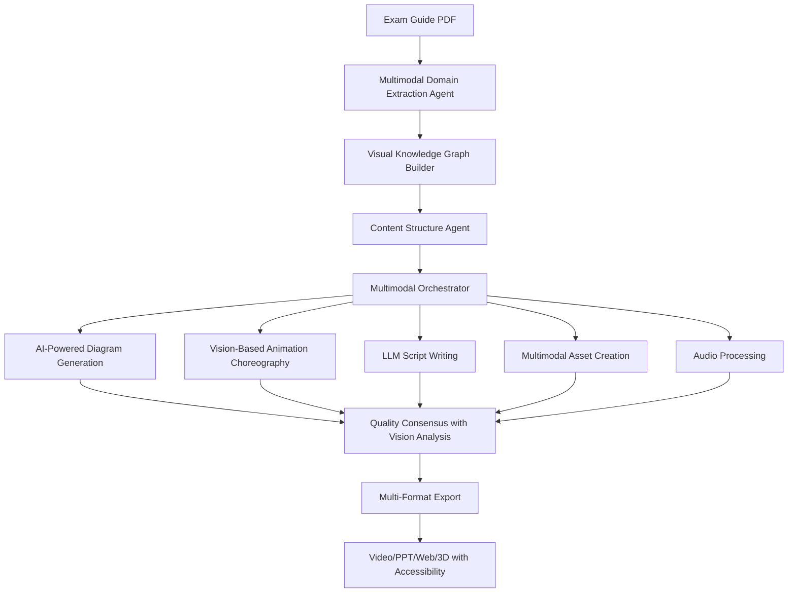

# Vision & Mission

## 🌟 Vision

**To democratize high-quality technical education by making enterprise-grade certification training accessible to everyone through AI-powered content generation.**

We have successfully implemented a truly agentic animation system with full multimodal capabilities. Our agents can now reason about visual storytelling through advanced AI vision and audio processing, creating dynamic content that adapts to learner needs.

Certify Studio envisions a world where:

- Quality technical education is not limited by geography, economics, or instructor availability
- Every learner has access to personalized, engaging, and accurate certification content
- The gap between certification requirements and practical skills is bridged through interactive learning
- Educational content creation is 100x faster while maintaining exceptional quality

## 🎯 Mission

Our mission is to build an AI-powered platform that automatically transforms certification exam guides into comprehensive, multi-modal learning experiences that rival and exceed traditional training methods.

## 💡 The Problem We're Solving

### Current State of Technical Certification Training

1. **High Cost Barrier**

   - Enterprise training courses cost $2,000-$5,000 per certification
   - Quality varies significantly between providers
   - Limited accessibility for individual learners and small companies
2. **Content Creation Bottleneck**

   - Creating professional technical animations takes weeks/months
   - Requires specialized skills in animation, design, and technical knowledge
   - Updates for new services or features lag behind technology changes
3. **Inconsistent Quality**

   - Content quality depends heavily on individual instructors
   - No standardized visual language across providers
   - Accessibility often an afterthought
4. **Static Learning Experience**

   - Traditional slides and videos lack interactivity
   - No personalization based on learning pace or style
   - Limited hands-on practice opportunities

## 🚀 Our Solution

### AI-Powered Multimodal Content Generation Pipeline

### Key Innovations

1. **Multimodal Multi-Agent Architecture**

   - Specialized AI agents with vision and audio capabilities
   - Vision-based quality validation using Claude Vision and GPT-4 Vision
   - Continuous improvement through multimodal feedback loops
   - Unified LLM infrastructure supporting multiple providers
2. **Enhanced Manim Framework with AI Vision**

   - Enterprise-grade animations with visual coherence analysis
   - AI-driven animation style adaptation from reference materials
   - Accessibility-first design with automatic captions and audio descriptions
   - Interactive elements powered by visual understanding
3. **Intelligent Multimodal Orchestration**

   - Visual and textual understanding of certification materials
   - Context-aware content generation with visual metaphors
   - Real-time quality monitoring using vision-based metrics
   - Audio narration with timing, emphasis, and sound effects

## 🚀 Multimodal Capabilities

### Vision Intelligence

1. **PDF Diagram Understanding**
   - Extracts and analyzes diagrams from certification materials
   - Understands visual relationships and architectures
   - Identifies visual learning opportunities
   - Maintains visual consistency across generated content

2. **Reference-Based Style Learning**
   - Analyzes existing educational materials for style patterns
   - Adapts animation aesthetics to match domain conventions
   - Ensures visual coherence throughout courses
   - Creates brand-consistent educational content

3. **Visual Quality Assessment**
   - AI-powered evaluation of generated diagrams
   - Iterative improvement based on visual metrics
   - Automatic optimization for clarity and comprehension
   - Real-time quality monitoring during generation

### Audio Integration

1. **Intelligent Narration**
   - Context-aware voice synthesis with proper pacing
   - Emphasis on key concepts and technical terms
   - Multiple voice options for different audiences
   - Synchronized with visual elements

2. **Soundscape Design**
   - Background music selection based on content mood
   - Strategic sound effects for engagement
   - Audio cues for important transitions
   - Ambient sounds for immersive learning

3. **Accessibility Features**
   - Automatic caption generation
   - Audio descriptions for visual content
   - Multi-language support
   - Adjustable playback speeds

### Intelligent Content Generation

1. **Multimodal Understanding**
   - Processes both text and visual information from source materials
   - Creates unified knowledge representations
   - Generates content that leverages multiple modalities
   - Adapts to different learning styles

2. **Dynamic Personalization**
   - Learner profile analysis for customized content
   - Adaptive pacing based on comprehension signals
   - Difficulty adjustment in real-time
   - Progress-based content modification

3. **Quality-Driven Generation**
   - Minimum quality thresholds (85%+)
   - Automatic content enhancement
   - Iterative refinement loops
   - Human-in-the-loop validation options

## 🎨 What Makes Us Different

### vs. Traditional Course Creation

- **Speed**: Hours instead of months
- **Consistency**: Standardized quality across all content
- **Updates**: Automatic updates when exam guides change
- **Cost**: 1% of traditional development cost

### vs. Existing Online Courses

- **Customization**: Personalized learning paths
- **Interactivity**: Clickable diagrams and quizzes
- **Multi-Modal**: Video, slides, web, and 3D formats
- **Accessibility**: Built-in from the ground up

### vs. ByteByteGo Style Content

- **Automated**: No manual animation required
- **Comprehensive**: Full course generation, not just snippets
- **Certified**: Aligned with official exam objectives
- **Interactive**: Beyond static animations

## 🌍 Impact Goals

### Year 1

- Generate 100+ complete certification courses
- Serve 10,000+ learners globally
- Achieve 90%+ pass rates for users
- Save $10M+ in training costs

### Year 3

- Cover all major cloud certifications
- Expand to cybersecurity and DevOps certifications
- Serve 100,000+ learners
- Enable career transitions for underserved communities

### Year 5

- Become the de facto standard for technical certification preparation
- Partner with certification bodies for official content
- Expand to corporate training and custom content
- Build ecosystem of content creators and validators

## 🤝 Who We Serve

### Primary Users

1. **Individual Learners**

   - Career changers seeking cloud certifications
   - IT professionals upskilling
   - Students preparing for industry certifications
2. **Small to Medium Businesses**

   - Teams needing certification training
   - Companies with limited training budgets
   - Remote teams requiring consistent training
3. **Educational Institutions**

   - Universities offering cloud computing courses
   - Bootcamps preparing students for certifications
   - Online learning platforms

### Secondary Users

1. **Enterprise Training Departments**

   - Large-scale certification initiatives
   - Standardized global training programs
   - Compliance and skill verification
2. **Content Creators**

   - Technical educators enhancing their courses
   - YouTubers creating certification content
   - Authors supplementing books with animations

## 🔮 Future Vision

### Phase 1: Foundation (Current)

- Core platform development
- AWS, Azure, GCP certification support
- Basic multi-agent content generation
- Essential export formats

### Phase 2: Enhancement

- Advanced interactivity and gamification
- Real-time collaboration features
- Mobile learning applications
- API for third-party integrations

### Phase 3: Intelligence

- Personalized learning AI tutor
- Predictive learning path optimization
- Automated lab environment generation
- Performance analytics and insights

### Phase 4: Ecosystem

- Marketplace for custom agents
- Community-contributed content validation
- Enterprise white-label solutions
- Certification body partnerships

## 💪 Core Values

1. **Accessibility First**

   - Every feature designed for inclusivity
   - Multiple learning modalities
   - Global language support planned
2. **Quality Without Compromise**

   - Enterprise-grade code and content
   - Continuous validation and improvement
   - No shortcuts or temporary solutions
3. **Learner Success**

   - Measured by certification pass rates
   - Focus on practical skills
   - Continuous feedback integration
4. **Open Innovation**

   - Open-source core components
   - Community-driven development
   - Transparent roadmap and progress

## 🎯 Success Metrics

1. **Content Quality**

   - 95%+ technical accuracy rate
   - 90%+ learner satisfaction score
   - 85%+ first-attempt pass rate
2. **Platform Performance**

   - < 30 minutes generation time per module
   - 99.9% uptime SLA
   - < 2 second page load times
3. **Business Impact**

   - 100x reduction in content creation time
   - 50x reduction in content creation cost
   - 10x improvement in content update speed

## 🌈 The Dream

Imagine a world where:

- A developer in rural India can access the same quality cloud certification training as someone in Silicon Valley
- A single parent can study for certifications with content that adapts to their available time
- A company can instantly generate custom training for their exact tech stack
- Educational content evolves as fast as technology itself

**This is the world Certify Studio is building.**

---

*"Education is the most powerful weapon which you can use to change the world."* - Nelson Mandela

We're not just building a platform; we're democratizing access to career-transforming education.
