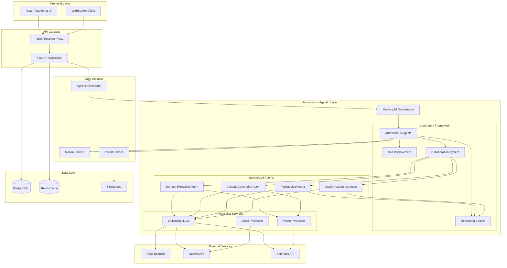

# Architecture Overview

## 🏗️ System Architecture

Certify Studio is built on a modern, scalable microservices architecture designed for enterprise-grade reliability and performance.



## 🎭 Core Components

### 1. API Layer (FastAPI)
- **RESTful API**: Handles all HTTP requests
- **WebSocket Support**: Real-time progress updates
- **Authentication**: JWT-based with role management
- **Rate Limiting**: Prevents abuse and ensures fair usage
- **API Versioning**: Backward compatibility support

### 2. Agent Orchestration System
- **Parallel Processing**: Multiple agents work simultaneously
- **State Management**: Tracks generation progress
- **Error Recovery**: Automatic retry with fallback
- **Resource Management**: Prevents system overload

### 3. AI Agent Framework
- **Modular Design**: Each agent has specific expertise
- **Consensus Mechanism**: Multiple agents validate output
- **Context Sharing**: Agents share knowledge graph
- **Performance Monitoring**: Track agent effectiveness

### 4. Manim Extension Framework
- **Scene Management**: Certification-specific scenes
- **Asset Library**: Official cloud provider icons
- **Animation Patterns**: Reusable animation components
- **Export Pipeline**: Multi-format rendering

### 5. Multimodal Processing Layer
- **Vision Processing**: Claude Vision and GPT-4 Vision integration
- **Audio Generation**: Narration, music, and sound effects
- **Unified LLM Interface**: Provider-agnostic multimodal support
- **Quality Analysis**: Vision-based content assessment

### 6. Autonomous Agent Framework
- **BDI Architecture**: Belief-Desire-Intention cognitive model
- **Multi-Level Memory**: Short-term, long-term, episodic, semantic, procedural
- **Reasoning Engine**: Deductive, inductive, causal, and analogical reasoning
- **Self-Improvement**: A/B testing, performance tracking, adaptive behavior
- **Collaboration System**: Six protocols for multi-agent coordination

## 🔄 Data Flow

### Multimodal Content Generation Flow
```
1. User uploads exam guide PDF
2. Multimodal Domain Agent analyzes text AND diagrams
3. Visual Knowledge Graph built with relationship extraction
4. Content Structure Agent plans course with visual learning
5. Parallel multimodal generation:
   - Multimodal Diagram Agent creates with style learning
   - Script Agent writes with audio timing
   - Multimodal Animation Agent uses visual references
   - Audio Processor generates narration and effects
6. Vision Quality Analysis validates visual coherence
7. Quality threshold check (85%+ required)
8. Export Service generates accessible formats
```

### Real-time Updates
```
1. WebSocket connection established
2. Progress events sent at each stage
3. Preview images generated and streamed
4. Final download URLs provided
```

## 🏛️ Design Principles

### 1. Modularity
- Each component has single responsibility
- Clear interfaces between modules
- Easy to test and maintain
- Supports independent scaling

### 2. Resilience
- Graceful degradation when services unavailable
- Automatic retries with exponential backoff
- Circuit breakers for external services
- Comprehensive error handling

### 3. Scalability
- Horizontal scaling for all services
- Queue-based async processing
- Caching at multiple levels
- Database connection pooling

### 4. Security
- Zero-trust architecture
- Encryption at rest and in transit
- Regular security audits
- OWASP compliance

## 🔧 Technology Decisions

### Why FastAPI?
- Native async support for high concurrency
- Automatic API documentation
- Type safety with Pydantic
- WebSocket support built-in
- Excellent performance

### Why Multi-Agent Architecture?
- Specialized expertise per domain
- Parallel processing capability
- Quality through consensus
- Easier to improve individual components
- Natural mapping to microservices

### Why Manim?
- Programmatic animation generation
- Mathematical precision
- Python ecosystem integration
- Active community
- Extensible architecture

### Why PostgreSQL + Redis?
- PostgreSQL: ACID compliance, JSON support
- Redis: Fast caching, pub/sub for real-time
- Proven scalability
- Excellent Python support

### Why Multimodal AI?
- **Comprehensive Understanding**: Analyzes both text and visual content
- **Visual Coherence**: Maintains consistent style across all materials
- **Enhanced Learning**: Leverages multiple modalities for better retention
- **Accessibility**: Automatic captions and audio descriptions
- **Quality Assurance**: Vision-based validation of generated content

### Why Autonomous Agents?
- **True Autonomy**: Agents think, plan, and act independently
- **Continuous Learning**: Self-improvement through experimentation
- **Collaborative Intelligence**: Complex tasks solved through teamwork
- **Adaptive Behavior**: Agents evolve based on performance
- **Scalable Intelligence**: Add more agents for increased capability

## 🤖 Agentic Architecture Details

### Agent Cognitive Cycle
```
1. Perceive: Gather observations from environment
2. Think: Analyze situation, update beliefs, generate intentions
3. Plan: Create actionable plans to achieve goals
4. Act: Execute plans in the environment
5. Reflect: Learn from outcomes, update strategies
6. Collaborate: Work with other agents when needed
```

### Multi-Agent Collaboration Protocols

#### Hierarchical Protocol
- One agent acts as leader, others as followers
- Leader decomposes tasks and delegates
- Followers report results back to leader
- Best for: Well-structured tasks with clear subtasks

#### Peer-to-Peer Protocol
- All agents work as equals
- Shared workspace for coordination
- Distributed decision making
- Best for: Creative tasks requiring diverse perspectives

#### Blackboard Protocol
- Agents contribute to shared problem space
- Opportunistic problem solving
- No central coordination
- Best for: Complex problems with unknown solution paths

#### Contract Net Protocol
- Tasks announced to all agents
- Agents bid based on capabilities
- Best bidder wins contract
- Best for: Dynamic task allocation

#### Swarm Protocol
- Simple rules lead to emergent behavior
- Agents leave pheromone trails
- Collective intelligence emerges
- Best for: Optimization and exploration tasks

#### Consensus Protocol
- Agents negotiate to reach agreement
- Multiple rounds of proposals
- Voting mechanisms for decisions
- Best for: Quality assurance and validation

### Agent Memory Architecture

```python
class AgentMemory:
    short_term: List[Dict]      # Current context (10 items)
    long_term: Dict[str, Any]   # Learned patterns
    episodic: List[Dict]        # Past experiences
    semantic: Dict[str, Any]    # Domain knowledge
    procedural: Dict[str, Any]  # How-to knowledge
```

### Self-Improvement Mechanisms

1. **Performance Tracking**
   - Success rate, completion time, quality scores
   - Resource efficiency, error rates
   - Learning curves for each task type

2. **A/B Testing Framework**
   - Hypothesis generation from bottlenecks
   - Controlled experiments with strategies
   - Statistical significance testing
   - Automatic adoption of improvements

3. **Adaptive Behavior**
   - Parameter tuning based on performance
   - Strategy selection using reinforcement learning
   - Model retraining with new data
   - Feedback incorporation

## 📊 Performance Targets

### Response Times
- API endpoints: < 200ms (p95)
- WebSocket latency: < 50ms
- Database queries: < 100ms (p95)
- Cache hit rate: > 80%

### Throughput
- 100 concurrent generations
- 1000 API requests/second
- 10,000 WebSocket connections
- 1TB daily export volume

### Reliability
- 99.9% uptime SLA
- < 0.1% error rate
- Zero data loss
- 15-minute recovery time

## 🔒 Security Architecture

### Authentication & Authorization
- JWT tokens with refresh mechanism
- Role-based access control (RBAC)
- API key management for services
- OAuth2 integration ready

### Data Protection
- Encryption at rest (AES-256)
- TLS 1.3 for all communications
- Secure credential storage (AWS Secrets Manager)
- Regular security audits

### Compliance
- GDPR compliant data handling
- SOC 2 Type II ready
- FERPA compliance for educational data
- Regular penetration testing

## 🚀 Deployment Architecture

### Development
- Docker Compose for local development
- Hot reload for all services
- Local S3 (MinIO) for storage
- Embedded PostgreSQL option

### Production
- Kubernetes orchestration
- Auto-scaling based on load
- Multi-region deployment
- CDN for static assets

### CI/CD Pipeline
- GitHub Actions for automation
- Automated testing (unit, integration, e2e)
- Security scanning (Snyk, OWASP)
- Blue-green deployments

## 📈 Monitoring & Observability

### Metrics (Prometheus)
- Application metrics
- Business metrics
- Infrastructure metrics
- Custom agent metrics

### Logging (ELK Stack)
- Structured logging
- Centralized log aggregation
- Real-time log analysis
- Alert automation

### Tracing (Jaeger)
- Distributed request tracing
- Performance bottleneck identification
- Service dependency mapping
- Error tracking

## 🔮 Future Architecture Evolution

### Phase 1: Current
- Monolithic API with agent modules
- Single region deployment
- Basic caching strategy

### Phase 2: Microservices
- Separate agent services
- Message queue integration
- Advanced caching with Redis Cluster

### Phase 3: Global Scale
- Multi-region deployment
- Edge computing for rendering
- Global CDN integration
- Real-time collaboration

### Phase 4: AI-Native
- Self-optimizing multimodal agents
- Predictive content generation
- Real-time learner adaptation
- Vision-based quality improvement
- Automated accessibility enhancement
- Self-healing infrastructure

### Phase 5: Next-Generation Multimodal
- 3D/VR content generation
- Real-time voice interaction
- Emotion-aware content adaptation
- Multi-language visual understanding
- Collaborative AI tutoring

---

For detailed component documentation:
- [AI Agent Architecture](./ai-agents.md)
- [Manim Extensions](./manim-extensions.md)
- [Database Design](./database-design.md)
- [API Design](./api-design.md)
