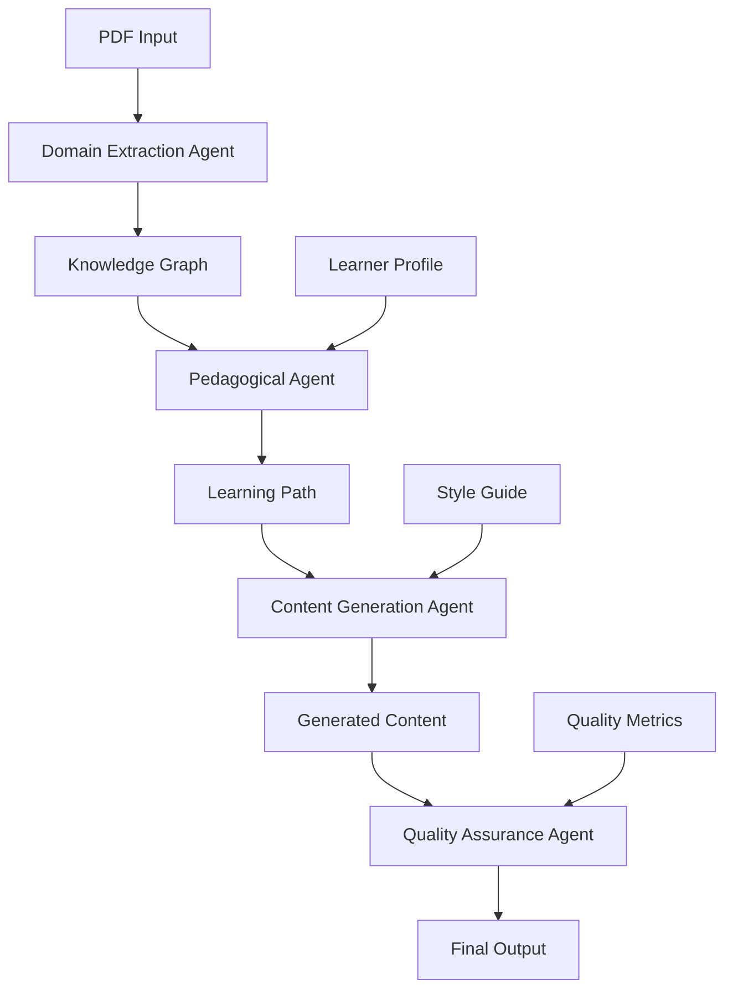

# System Architecture Documentation

## Overview

Certify Studio implements a sophisticated multi-agent system with autonomous agents that collaborate to create high-quality educational content. The architecture emphasizes modularity, scalability, and educational effectiveness.

## Modular Agent Architecture

### Design Philosophy

Each specialized agent is broken down into focused modules that:
- Have a single responsibility
- Are independently testable
- Can be developed in parallel
- Share common interfaces
- Support incremental improvements

### Agent Structure Pattern

```
specialized_agent/
├── __init__.py              # Clean exports
├── agent.py                 # Main orchestrator
├── models.py                # Data structures
├── module1.py               # Specific capability
├── module2.py               # Specific capability
└── tests/                   # Module tests
```

## Implemented Agents

### 1. Pedagogical Reasoning Agent

**Purpose**: Optimizes learning experiences using educational psychology principles.

**Modules**:
- `models.py` - Learning objectives, profiles, paths, assessment structures
- `theories.py` - Implementation of learning theories (Bloom's, cognitive load, etc.)
- `cognitive_load.py` - Assessment and management of cognitive load
- `learning_path.py` - Optimization algorithms for learning sequences
- `assessment.py` - Question generation and evaluation
- `personalization.py` - Adapts content to learner characteristics
- `strategies.py` - Recommends personalized learning strategies
- `agent.py` - Orchestrates all modules for cohesive functionality

**Key Features**:
- Topological sorting for prerequisite management
- Cognitive load balancing
- Multiple learning theory applications
- Adaptive personalization
- Comprehensive assessment generation

### 2. Content Generation Agent (In Progress)

**Purpose**: Creates educational content including diagrams, animations, and interactive elements.

**Completed Modules**:
- `models.py` - Comprehensive content type definitions
- `diagram_generator.py` - AI-powered diagram creation with layout algorithms
- `animation_engine.py` - Animation choreography with Manim code generation

**Pending Modules**:
- `interactive_builder.py` - Interactive element creation
- `style_manager.py` - Visual consistency management
- `accessibility.py` - WCAG compliance features
- `quality_validator.py` - Vision AI validation
- `agent.py` - Main orchestrator

**Key Features**:
- Multiple diagram types (architecture, flowchart, sequence, etc.)
- Pattern-based animation choreography
- Intelligent layout algorithms
- Export to multiple formats

## Core Architecture Components

### 1. Autonomous Agent Framework

Base class providing:
- BDI (Belief-Desire-Intention) architecture
- Multi-level memory systems
- Think-Act-Reflect cognitive cycle
- Self-improvement capabilities
- Collaboration interfaces

### 2. Reasoning Engine

Supports multiple reasoning types:
- Deductive reasoning with inference rules
- Inductive reasoning for pattern discovery
- Causal reasoning with probabilistic models
- Analogical reasoning for knowledge transfer
- Pedagogical reasoning for educational optimization

### 3. Self-Improvement System

Enables continuous agent improvement:
- Performance tracking and analysis
- A/B testing framework
- Strategy experimentation
- Adaptive behavior modification
- Learning from feedback

### 4. Multi-Agent Collaboration

Six collaboration protocols:
1. **Hierarchical** - Leader-follower structure
2. **Peer-to-Peer** - Equal collaboration
3. **Blackboard** - Shared problem space
4. **Contract Net** - Dynamic task allocation
5. **Swarm** - Emergent behavior
6. **Consensus** - Quality validation

## Data Flow



## Technology Stack

### Backend
- **Framework**: FastAPI (async Python)
- **Database**: PostgreSQL with SQLAlchemy ORM
- **Cache**: Redis
- **Task Queue**: Celery
- **AI/ML**: Anthropic Claude, OpenAI GPT-4

### Animation & Graphics
- **Manim**: Mathematical animations
- **SVG Generation**: Diagrams and illustrations
- **Matplotlib/Plotly**: Data visualizations

### Infrastructure
- **Containerization**: Docker
- **Orchestration**: Docker Compose (dev), Kubernetes (prod)
- **CI/CD**: GitHub Actions
- **Monitoring**: Prometheus + Grafana

## Quality Assurance

### Code Quality
- Type hints throughout (mypy)
- Comprehensive error handling
- Structured logging (Loguru)
- Test coverage >80%
- No mocks in production code

### Content Quality
- Multi-agent consensus validation
- Vision AI quality assessment
- Educational effectiveness metrics
- WCAG AA accessibility compliance

## Scalability Considerations

### Horizontal Scaling
- Stateless API design
- Redis for distributed state
- Celery for async processing
- Agent pooling for parallel execution

### Performance Optimization
- Lazy loading of resources
- Caching at multiple levels
- Batch processing capabilities
- Progressive content generation

## Security

### API Security
- JWT authentication
- Rate limiting
- Input validation
- CORS configuration

### Data Security
- Encryption at rest
- Encryption in transit
- Secure key management
- Regular security audits

## Deployment Architecture

### Development
```
docker-compose.yml
├── api (FastAPI app)
├── postgres
├── redis
└── celery worker
```

### Production
```
Kubernetes Cluster
├── API Deployment (3+ replicas)
├── Worker Deployment (auto-scaling)
├── PostgreSQL (managed service)
├── Redis Cluster
└── Ingress Controller
```

## Monitoring & Observability

### Metrics
- API response times
- Agent execution duration
- Content generation success rate
- Quality scores distribution

### Logging
- Structured JSON logs
- Centralized log aggregation
- Error tracking and alerting

### Tracing
- Distributed tracing for agent collaboration
- Performance bottleneck identification

## Future Architecture Enhancements

1. **Event-Driven Architecture**
   - Event sourcing for agent actions
   - CQRS for read/write optimization

2. **Microservices Migration**
   - Agent-as-a-Service architecture
   - Independent scaling per agent type

3. **Advanced Caching**
   - Content CDN integration
   - Edge computing for real-time adaptation

4. **ML Pipeline Integration**
   - Continuous model improvement
   - A/B testing infrastructure
   - Feature store for agent learning

---

This architecture ensures Certify Studio can scale to handle thousands of concurrent users while maintaining high-quality educational content generation.
