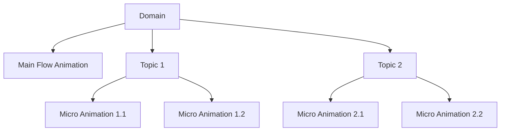

# CERTIFY STUDIO: IMMUTABLE MASTER VISION
*This document represents the unchanging core vision and principles of Certify Studio*

## 🎯 THE REVOLUTIONARY VISION

**To create a fully autonomous system that transforms certification exam guides into complete, production-ready educational content with ZERO manual intervention.**

## 🔥 CORE INNOVATIONS (Never to be Compromised)

### 1. DOMAIN ABSTRACTION - The Foundation
The breakthrough innovation that enables everything else:

```
EXAM GUIDE UPLOAD → AUTOMATIC DOMAIN EXTRACTION → COMPLETE COURSE GENERATION
```

**Key Principle**: Users upload ONLY:
- Certification exam guide (PDF with domains, topics, concepts)
- Official training materials (text, images, videos)

**System Automatically**:
- Extracts ALL domains from the exam guide
- Identifies topics within each domain
- Maps concepts under each topic
- Creates complete hierarchical learning structure
- Generates BOTH main flow AND micro-animations

### 2. ZERO HARDCODING PHILOSOPHY
**Everything must be data-driven and automated:**
- No hardcoded AWS/Azure/GCP specific logic
- No manual animation sequences
- No pre-defined templates
- System learns from uploaded materials and generates everything

### 3. MAIN FLOW + MICRO-ANIMATIONS ARCHITECTURE



**Revolutionary Approach**:
- **Main Flow**: High-level domain animation with official icons/architecture
- **Micro Animations**: Deep-dive animations for EACH stage/topic/concept
- This creates a hierarchical, comprehensive learning experience

### 4. ENTERPRISE-GRADE VISUAL STANDARDS
- Official provider icons (AWS/Azure/GCP)
- Industry-standard architectures
- Professional color schemes
- Certification-aligned layouts
- NO amateur visuals or generic icons

## 🧬 THE AGENTIC ARCHITECTURE

### Multi-Agent Orchestration with Domain Intelligence

```python
class DomainAbstractionOrchestrator:
    """The heart of Certify Studio - extracts and understands certification domains"""
    
    async def process_certification(self, exam_guide: PDF, training_materials: List[Resource]):
        # 1. Domain Extraction Agent
        domains = await self.domain_agent.extract_complete_hierarchy(exam_guide)
        # Returns: {domain -> topics -> concepts} structure
        
        # 2. Knowledge Integration Agent
        enriched_knowledge = await self.knowledge_agent.integrate_materials(
            domains, training_materials
        )
        
        # 3. Animation Generation Pipeline
        for domain in domains:
            # Generate main domain flow
            main_flow = await self.generate_main_flow(domain)
            
            # Generate micro-animations for EACH topic
            for topic in domain.topics:
                micro_animations = await self.generate_micro_animations(topic)
                
        # 4. Quality Consensus
        validated_content = await self.quality_agents.reach_consensus(all_animations)
        
        return complete_course
```

### Agent Specializations (Aligned with Core Vision)

1. **Domain Extraction Agent**
   - Reads exam guides with vision AI
   - Extracts complete domain/topic/concept hierarchy
   - Zero manual mapping required

2. **Visual Standards Agent**
   - Ensures official provider icons
   - Maintains enterprise-grade quality
   - Applies certification visual language

3. **Animation Orchestration Agent**
   - Creates main flows for domains
   - Generates micro-animations for topics
   - Maintains visual coherence

4. **Quality Consensus Agent**
   - Multiple AI critics reach consensus
   - Ensures certification accuracy
   - Validates enterprise standards

## 📐 ARCHITECTURAL PRINCIPLES

### 1. Complete Automation Pipeline
```
User Uploads → Domain Extraction → Knowledge Integration → 
Animation Generation → Quality Consensus → Multi-Format Export
```

**NO MANUAL STEPS ANYWHERE**

### 2. Hierarchical Content Generation
- **Level 1**: Certification overview
- **Level 2**: Domain main flows
- **Level 3**: Topic micro-animations
- **Level 4**: Concept deep dives

### 3. Data-Driven Everything
- Animations generated from extracted data
- Styles learned from uploaded materials
- Layouts determined by domain structure
- No hardcoded sequences

### 4. Enterprise Production Standards
- Every output must be client-ready
- No prototypes or MVPs
- Production-grade from day one
- Fortune 500 quality bar

## 🚀 THE BREAKTHROUGH CAPABILITIES

### 1. Upload → Complete Course
- User uploads exam guide + materials
- System generates ENTIRE certification course
- Zero configuration required
- Works for ANY certification

### 2. Intelligent Micro-Animations
- Not just high-level overviews
- Deep-dive animations for every concept
- Adaptive complexity based on topic
- Maintains narrative coherence

### 3. Multi-Modal Knowledge Integration
- Text extraction from PDFs
- Visual learning from diagrams
- Video content analysis
- Audio narration generation
- All integrated automatically

### 4. Consensus-Driven Quality
- Multiple AI agents validate content
- Iterative improvement until consensus
- Maintains 95%+ accuracy
- Enterprise-grade output guaranteed

## 🎪 THE PLATFORM ARCHITECTURE

```
┌─────────────────────────────────────────────────────────────┐
│                     DOMAIN ABSTRACTION LAYER                │
│  Extracts complete domain/topic/concept hierarchy from PDF  │
├─────────────────────────────────────────────────────────────┤
│                    KNOWLEDGE INTEGRATION LAYER              │
│  Integrates all uploaded materials into unified knowledge   │
├─────────────────────────────────────────────────────────────┤
│                  ANIMATION GENERATION LAYER                 │
│  Main Flows + Micro Animations for every topic/concept     │
├─────────────────────────────────────────────────────────────┤
│                    QUALITY CONSENSUS LAYER                  │
│  Multi-agent validation ensuring enterprise standards       │
├─────────────────────────────────────────────────────────────┤
│                    EXPORT PIPELINE LAYER                    │
│  Video, PowerPoint, Interactive Web, 3D formats            │
└─────────────────────────────────────────────────────────────┘
```

## 🏛️ IMMUTABLE PRINCIPLES

1. **Domain Abstraction First**: Everything flows from automatic domain extraction
2. **Zero Manual Intervention**: If it requires human input, it's broken
3. **Enterprise Quality Only**: No shortcuts, no MVPs, production-ready always
4. **Hierarchical Completeness**: Main flows AND micro-animations for everything
5. **Official Standards**: Industry icons, proper architectures, no substitutes
6. **Consensus Quality**: Multiple agents must agree before release
7. **Universal Application**: Must work for ANY certification, not just AWS
8. **Knowledge Integration**: Leverages ALL uploaded materials automatically
9. **Continuous Learning**: System improves with each certification processed
10. **Accessibility Built-in**: Every feature accessible from day one

## 🎯 SUCCESS METRICS

1. **Automation**: 100% hands-off after upload
2. **Coverage**: Every domain, topic, and concept animated
3. **Quality**: 95%+ technical accuracy
4. **Standards**: 100% official provider assets
5. **Speed**: Complete course in < 1 hour
6. **Universality**: Works for all cloud certifications

## 🚫 WHAT WE WILL NEVER DO

1. Create templates that require manual customization
2. Use generic icons instead of official provider assets
3. Generate only high-level overviews without micro-animations
4. Require users to map domains/topics manually
5. Produce anything less than enterprise-grade quality
6. Compromise on the complete automation vision

## 🌟 THE ULTIMATE GOAL

**A user uploads an exam guide and training materials. They return an hour later to find a complete, professional, multi-format certification course with main domain flows and detailed micro-animations for every concept - indistinguishable from content that took months to create manually.**

This is not incremental improvement. This is revolution.

---

*This document is immutable. It represents our North Star. Every feature, every line of code, every decision must align with this vision.*

*Created: November 2024*
*Status: IMMUTABLE*