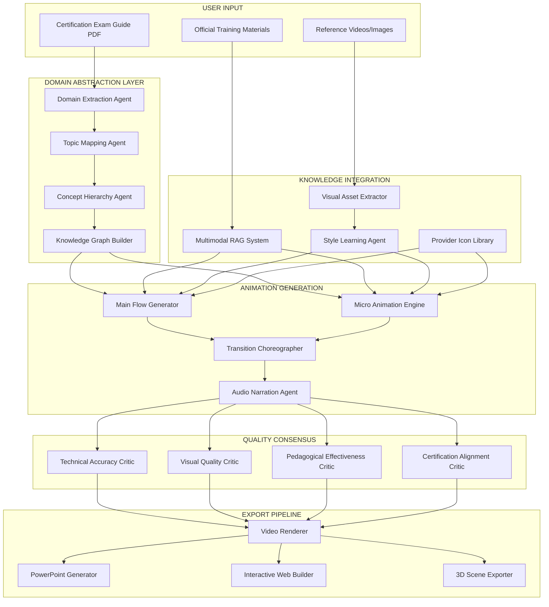

# TECHNICAL ARCHITECTURE: DOMAIN ABSTRACTION PIPELINE

## The Complete Automation Flow



## Multi-Agent Consensus Architecture

### The Revolutionary Quality Control System

The quality consensus mechanism implements a sophisticated multi-agent critique system where each agent/LLM evaluates the work of others until they reach consensus. This ensures enterprise-grade quality through iterative refinement.

```python
class QualityConsensusOrchestrator:
    """
    Multi-agent system where critics evaluate content AND each other's critiques
    until consensus is reached, with optional human validation
    """
    
    def __init__(self):
        # Specialized critic agents
        self.critics = {
            'technical': TechnicalAccuracyCritic(),
            'visual': VisualQualityCritic(),
            'pedagogical': PedagogicalEffectivenessCritic(),
            'certification': CertificationAlignmentCritic()
        }
        
        # Learning and feedback systems
        self.learning_system = ContinuousLearningSystem()
        self.human_validator = HumanValidationInterface()
        self.synthesis_agent = FeedbackSynthesisAgent()
        
    async def reach_consensus(self, content):
        """
        Iterative critique process until consensus reached
        """
        max_iterations = 5
        consensus_threshold = 0.85
        
        for iteration in range(max_iterations):
            # Phase 1: Each critic evaluates the content independently
            evaluations = {}
            for name, critic in self.critics.items():
                evaluations[name] = await critic.evaluate(
                    content=content,
                    iteration=iteration
                )
            
            # Phase 2: Critics evaluate each other's evaluations
            cross_evaluations = await self.cross_critique(evaluations)
            
            # Phase 3: Calculate consensus score
            consensus_score = self.calculate_consensus(
                evaluations, 
                cross_evaluations
            )
            
            # Phase 4: Check if consensus reached
            if consensus_score >= consensus_threshold:
                # Optional human validation
                if self.human_validation_enabled:
                    validated_content = await self.human_validation_phase(
                        content, evaluations, consensus_score
                    )
                    return validated_content
                
                return content
            
            # Phase 5: Synthesize improvements from all feedback
            improvements = await self.synthesis_agent.create_improvements(
                content=content,
                evaluations=evaluations,
                cross_evaluations=cross_evaluations
            )
            
            # Phase 6: Apply improvements
            content = await self.apply_improvements(content, improvements)
            
            # Phase 7: Update learning system
            await self.learning_system.record_iteration(
                iteration=iteration,
                evaluations=evaluations,
                improvements=improvements,
                consensus_score=consensus_score
            )
        
        # Final human review if consensus not reached
        return await self.escalate_to_human(content, evaluations)
    
    async def cross_critique(self, evaluations):
        """
        Each critic evaluates other critics' evaluations
        """
        cross_evaluations = {}
        
        for critic_name, critic in self.critics.items():
            # Get other critics' evaluations
            other_evaluations = {
                name: eval for name, eval in evaluations.items() 
                if name != critic_name
            }
            
            # This critic evaluates others' work
            cross_evaluations[critic_name] = await critic.evaluate_peer_reviews(
                other_evaluations
            )
        
        return cross_evaluations
    
    async def human_validation_phase(self, content, evaluations, consensus_score):
        """
        Optional human validation with feedback incorporation
        """
        human_feedback = await self.human_validator.review(
            content=content,
            ai_evaluations=evaluations,
            consensus_score=consensus_score,
            preview_url=self.generate_preview_url(content)
        )
        
        if human_feedback.approved:
            # Record successful validation
            await self.learning_system.record_success(
                content=content,
                evaluations=evaluations,
                human_feedback=human_feedback
            )
            return content
        else:
            # Incorporate human feedback and regenerate
            improved_content = await self.incorporate_human_feedback(
                content=content,
                feedback=human_feedback
            )
            
            # Update learning system with human insights
            await self.learning_system.learn_from_human(
                original=content,
                improved=improved_content,
                feedback=human_feedback
            )
            
            return improved_content
```

### Continuous Learning System

```python
class ContinuousLearningSystem:
    """
    System that improves over time based on consensus patterns and human feedback
    """
    
    def __init__(self):
        self.pattern_database = PatternDatabase()
        self.strategy_optimizer = StrategyOptimizer()
        self.performance_tracker = PerformanceTracker()
        
    async def learn_from_human(self, original, improved, feedback):
        """
        Extract patterns from human corrections
        """
        # Identify what changed
        differences = await self.analyze_differences(original, improved)
        
        # Extract patterns
        patterns = await self.extract_patterns(
            differences=differences,
            feedback=feedback.comments,
            context=feedback.context
        )
        
        # Store patterns for future use
        await self.pattern_database.store(patterns)
        
        # Update critic strategies
        new_strategies = await self.strategy_optimizer.generate_strategies(
            patterns=patterns,
            current_performance=await self.performance_tracker.get_metrics()
        )
        
        # Apply new strategies to critics
        for critic_name, strategy in new_strategies.items():
            critic = self.critics[critic_name]
            await critic.update_evaluation_strategy(strategy)
    
    async def record_iteration(self, iteration, evaluations, improvements, consensus_score):
        """
        Track performance metrics and patterns
        """
        metrics = {
            'iteration': iteration,
            'consensus_score': consensus_score,
            'improvement_count': len(improvements),
            'critic_agreement': self.calculate_agreement(evaluations),
            'timestamp': datetime.now()
        }
        
        await self.performance_tracker.record(metrics)
        
        # Identify recurring issues
        if iteration > 3:  # Taking too long to reach consensus
            recurring_issues = await self.identify_recurring_issues(
                evaluations, 
                historical_data=await self.get_historical_evaluations()
            )
            
            if recurring_issues:
                await self.alert_system_administrators(recurring_issues)
```

## Domain Abstraction Example

### Input: AWS Solutions Architect Exam Guide
```
Domain 1: Design Resilient Architectures
├── Topic 1.1: Design a multi-tier architecture solution
│   ├── Concept: Load balancing
│   ├── Concept: Auto-scaling
│   └── Concept: Fault tolerance
├── Topic 1.2: Design highly available architectures
│   ├── Concept: Multi-AZ deployments
│   ├── Concept: Backup strategies
│   └── Concept: Disaster recovery
└── Topic 1.3: Design decoupling mechanisms
    ├── Concept: SQS
    ├── Concept: SNS
    └── Concept: Event-driven architecture
```

### Automatic Output Structure
```
Main Flow Animation: "Design Resilient Architectures"
├── Shows complete architecture with all components
├── Uses official AWS icons
└── 3-5 minute overview

Micro Animations:
├── "Load Balancing Deep Dive" (2 min)
├── "Auto-scaling Mechanics" (2 min)
├── "Fault Tolerance Patterns" (3 min)
├── "Multi-AZ Setup" (2 min)
├── "Backup Strategy Implementation" (3 min)
├── "DR Planning Walkthrough" (4 min)
├── "SQS Message Flow" (2 min)
├── "SNS Fan-out Pattern" (2 min)
└── "Event-driven Design" (3 min)
```

## The Magic: Zero Configuration Required

1. **Upload Materials**
   - Exam guide PDF
   - AWS training docs
   - Reference architectures

2. **Automatic Extraction**
   - AI reads exam guide
   - Builds domain hierarchy
   - Maps all concepts

3. **Intelligent Generation**
   - Creates main flows per domain
   - Generates micro-animations per concept
   - Maintains visual coherence

4. **Quality Assurance**
   - Multiple AI critics review
   - Critics evaluate each other
   - Consensus required
   - Optional human validation
   - Continuous learning from feedback

5. **Multi-Format Export**
   - MP4 videos
   - PowerPoint decks
   - Interactive web
   - 3D visualizations

## No Human Required Anywhere (Unless Desired)

This is the revolution: Complete automation from PDF to professional course, with optional human-in-the-loop for continuous improvement.